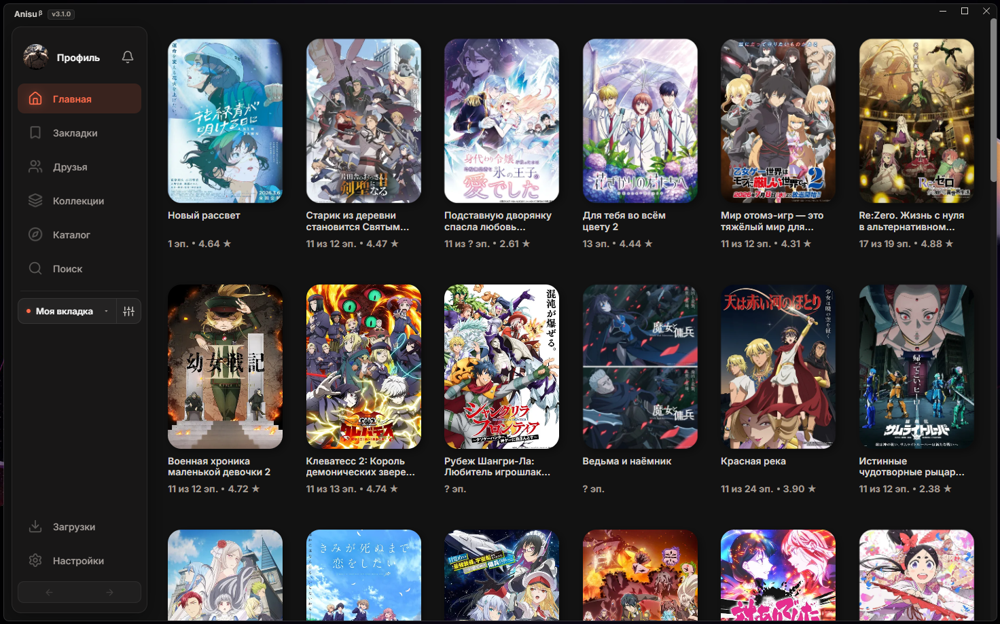

# Anisu β (Custom Build)

**Anisu β** (ранее известен как re-AniDesk) — неофициальный десктопный клиент для просмотра аниме на базе [AniDesk](https://github.com/theDesConnet/AniDesk) (Anixart API). Форк с эксклюзивными визуальными изменениями, оффлайн-режимом, расширенными возможностями плеера и встроенным обходом блокировок (CDN-прокси) для бесперебойной загрузки контента.

---

## ℹ️ Что нужно знать перед установкой

- **Название приложения:** официальное имя проекта — **Anisu β**.
- **Статус Beta:** проект активно развивается, поэтому дизайн, интерфейс и отдельные решения могут меняться или дополняться в следующих обновлениях.
- **Регистрация и вход:** приложение поддерживает вход в уже существующий аккаунт (полноценную регистрацию постараюсь внедрить в будущих обновлениях). Для удобства на экране входа есть кнопка «Регистрация», которая ведёт на официальный сайт Anixart (Android), где можно создать профиль.
- **Тестирование и баги:** весь заявленный функционал проверен, но если вы поймали ошибку — заведите Issue на GitHub, всё оперативно поправим.

> [!TIP]
> **Нашли баг или есть идея для фичи?** Заведите **[Issue](https://github.com/Ar3sSs-dev/Anisu/issues)** по готовому шаблону — с подробностями проблема решается быстрее.

---

## 🔥 Ключевые возможности Anisu β (Отличия от оригинала)

### 📺 Умный плеер
- **Автопропуск опенингов и эндингов (AniSkip):** Интеграция с базой Shikimori — плеер сам определяет таймкоды заставок и пропускает их автоматически или по кнопке.
- **Нейросетевой апскейл (WebGPU Anime4K):** Улучшение четкости видео работает в реальном времени как онлайн, так и для серий, скачанных на диск.
- **Гибкая настройка картинки:** Режимы соотношения сторон («Оригинальное», 16:9, 4:3, «Растянуть», «Заполнение») с защитой от вылезания видео на экранах 16:10 и Ultrawide.
- **Таймер сна и память:** Таймер авто-паузы (5–60 минут), запоминание секунды просмотра, выбранной озвучки и плеера.
- **Удобная навигация:** Кнопка «Назад» в плеере возвращает к странице тайтла с сохранением точного места скролла.

### 📥 Оффлайн-загрузчик 2.0
- **Скачивание сезона в 1 клик:** Пакетная загрузка всех серий сразу с отображением прогресса и очереди.
- **Мгновенная перемотка:** Локальный плеер воспроизводит скачанные файлы через протокол `anisu-offline://` без задержек и чёрного экрана.
- **Безопасная отмена:** Возможность отменить всю очередь или отдельную серию — временный мусор (`.tmp`) сразу удаляется с диска.

### 🧭 Страница тайтла и навигация
- **Серии прямо на странице:** Список эпизодов встроен в страницу релиза (без модальных окон) с переключением вида (сетка или компактный список).
- **Хронология франшизы:** Интерактивный таймлайн всех сезонов и фильмов по годам выхода с отметкой, какую часть вы смотрите сейчас.
- **Быстрый поиск (Ctrl + K / Ctrl + Л):** Мгновенный вызов строки поиска из любого места с историей запросов и подбором жанров.
- **Календарь онгоингов:** Расписание выхода свежих серий по дням недели и сезонам года.

### 🛡️ Стабильность и системная интеграция
- **Чистая 64-битная архитектура (x64):** Высокая производительность видеоядра и отсутствие ограничений по памяти.
- **Интеграция с Windows:** Сворачивание и закрытие в системный трей возле часов, защита от зависших фоновых процессов.
- **Discord Rich Presence 2.0:** Статус в Discord с названием аниме и таймкодами без вылетов Vesktop и arRPC.
- **Четкий интерфейс (High-DPI):** Аппаратное сглаживание шрифтов и графики без размытия на мониторах с масштабом 125% и 150%.
- **Профиль без ошибок:** Аватарки автоматически сжимаются перед отправкой, исключая ошибки сервера Anixart.

---

## ⚠️ Лицензия и авторские права

> [!CAUTION]
> **Проект распространяется под лицензией `GNU GPL v2`.**
>
> Использование, изменение и распространение кода (полностью или частично) допускается только с сохранением уведомлений об авторских правах, указанием оригинального автора/источника и внесённых изменений, а также с распространением производных работ под той же лицензией с открытым исходным кодом.
>
> **Присвоение авторства, удаление лицензии или выдача кода за собственную разработку — нарушение авторского права**, влекущее удаление репозитория по жалобе правообладателя (DMCA), публичную фиксацию факта плагиата, а при коммерческом использовании — юридическую ответственность.

---

## 📥 Установка и запуск

1. Откройте раздел **[Releases](https://github.com/Ar3sSs-dev/Anisu/releases)**.
2. Скачайте нужный файл из **Assets**:
   - **`anisu-*-x64.exe`** — автоматический установщик.
   - **`Anisu-win32-x64-*.zip`** — портативная версия (распакуй и запускай).
3. Запустите файл — дополнительных программ устанавливать не нужно.
